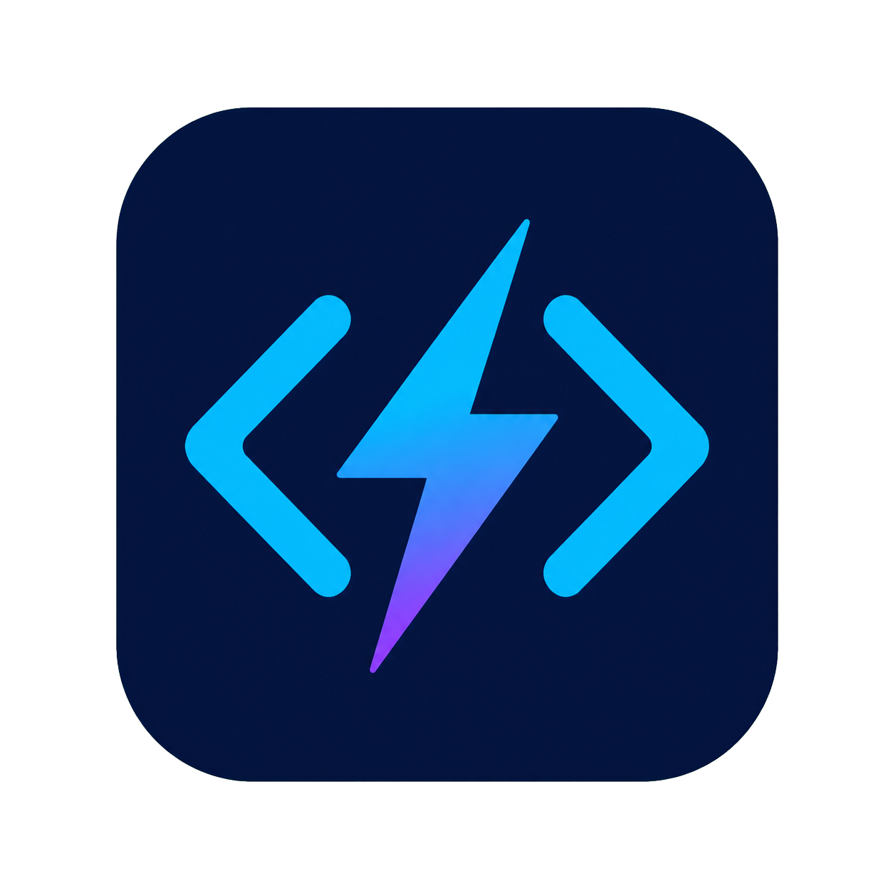

<div align="center">



# Lite Dev-C++

A lightweight C/C++ editor for macOS, built with Rust and inspired by Dev-C++.

[](https://github.com/AlightSoulmate/Lite-Dev-Cpp/releases/latest)
[](https://github.com/AlightSoulmate/Lite-Dev-Cpp/actions/workflows/release.yml)
[](https://github.com/AlightSoulmate/Lite-Dev-Cpp/blob/main/LICENSE)


Open folders, edit C/C++ files, and build and run programs without installing a heavyweight IDE.

[Download the latest release](https://github.com/AlightSoulmate/Lite-Dev-Cpp/releases/latest)

</div>

## Features

- Lightweight native macOS application.
- Folder-based workflow with a built-in file tree.
- Editing for common C/C++ source and header files.
- Syntax highlighting, automatic indentation, and paired brackets and quotes.
- Configurable C and C++ compiler commands.
- One-click build and run with compiler output shown inside the app.
- System terminal support for programs that read from standard input.

## Quick Start

1. Install the Xcode Command Line Tools if they are not already available:

   ```sh
   xcode-select --install
   ```

2. Download `Lite-Dev-Cpp-macOS-universal.zip` from the [latest release](https://github.com/AlightSoulmate/Lite-Dev-Cpp/releases/latest), extract it, and open the app.
3. Open a folder, select a C or C++ source file, then click `Build & Run`.

> [!NOTE]
> Lite Dev-C++ does not include a C/C++ compiler. The Xcode Command Line Tools provide `clang` and `clang++` on macOS.

## Compiler Configuration

The compiler commands can be changed in the top toolbar. Click `Save Config` to store them in the macOS application configuration directory:

```text
~/Library/Application Support/dev.LiteDevCpp.Lite-Dev-C++/config.toml
```

Default configuration:

```toml
[compiler]
c_compiler = "clang"
cpp_compiler = "clang++"
```

## Supported Files

Lite Dev-C++ can open and edit `.c`, `.cpp`, `.cc`, `.cxx`, `.h`, `.hpp`, `.hh`, and `.hxx` files. Builds are available for `.c`, `.cpp`, `.cc`, and `.cxx` source files.

The compiled executable is named `a` and written beside the current source file. Building another source file in the same folder replaces that executable.

## Current Limitations

Lite Dev-C++ is an early, minimal editor rather than a full IDE. It does not yet include:

- A debugger.
- Project templates.
- Full code completion or integrated `clangd` diagnostics.
- Multi-file project build configuration.
- macOS code signing and notarization.

Because the current macOS release is unsigned, macOS may require you to approve the app manually in **System Settings → Privacy & Security** before opening it.

## Development

The application is written in Rust with `egui`/`eframe`. To run it from source:

```sh
cargo run
```

## License

Lite Dev-C++ is available under the [MIT License](LICENSE).
